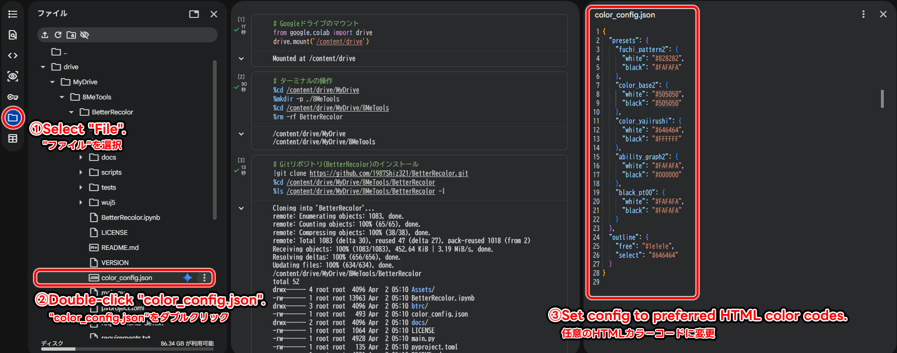

[](https://github.com/8MeTools/BetterRecolor/actions/workflows/ci.yml)
[](https://www.python.org/downloads/)
[](https://opensource.org/licenses/MIT)
# BetterRecolor

For Japanese, see [README_JP.md](README_JP.md).

## Overview

This tool lets you batch-edit button and text colors shown in-game.  
It edits files decoded to JSON5 format, then encodes them back to BRLYT (layout files) and BRLAN (animation files). You can use it on Google Colab or in a local environment.

## Getting Started

If you are new to Google Colaboratory, this video may help:

- [How to Use GOOGLE COLAB | Google Colab Tutorials for Beginners | GeeksforGeeks](https://youtu.be/TqqkZLHoY0o?si=wo1SAvFcU866YvkZ)

### Why Colab

- **Environment-independent**  
  Processing runs on assigned cloud machines, so results are not tied to your local PC setup.
- **No local setup required**  
  You can run code in the browser, so local Python and library installation are unnecessary. Even without Python knowledge, you can use the tool by running cells.

## Usage

There are two ways to run BetterRecolor:

- **Run on Google Colab**: Best if you want to use it without local setup
- **Run locally**: Best if you want to iterate repeatedly on your own machine

The input/output model is the same for both methods:

- Input: `Assets/BRLYT` and `Assets/BRLAN`
- Output: `Output`
- Color settings file: `color_config.json`

### 1. Run on Google Colab

1. **Open the notebook in Colab**

   Open [BetterRecolor.ipynb](BetterRecolor.ipynb) in this repository, then choose Open in Colab.

> [!WARNING]
> If you are not confident with Colab execution order, always open the notebook from GitHub for each run. Since this repository may be updated frequently, opening and running a cloned notebook via Google Drive may lead to unexpected behavior if the notebook is updated after cloning.

2. **Run setup cells first**

   Run only until these setup tasks are complete:

   - Mount Google Drive
   - Move to `MyDrive/8MeTools` and re-fetch `BetterRecolor` (the existing `BetterRecolor` folder will be removed and cloned again)
   - Install dependencies from `requirements.txt`

> [!WARNING]
> The Colab setup cell will delete the existing `/content/drive/MyDrive/8MeTools/BetterRecolor` folder before cloning.  
> If you have an edited `color_config.json`, download it beforehand or copy it somewhere else in Google Drive, then move it back after setup.
> However, since the JSON structure may change, it's recommended to check the latest `color_config.json` on GitHub before editing.

   When setup finishes successfully, you should see this message:

   ```
   ✅Setup complete! Open color_config.json to edit.
   ```

> [!WARNING]
> The setup section is only the first few cells. Do not run all cells yet.

3. **Edit `color_config.json`**

   Edit this file:

   `/content/drive/MyDrive/8MeTools/BetterRecolor/color_config.json`

   - `presets`: Colors used on the BRLYT side
   - `outline.free` / `outline.select`: Outline colors used on the BRLAN side
   - Use `#RRGGBB` format for all color values

> [!NOTE]
> In Colab, you can open the left file pane and go through `MyDrive` -> `8MeTools` -> `BetterRecolor`, then double-click `color_config.json` to edit it.
> 

4. **Run the remaining cells from top to bottom**

   These steps are performed by the remaining cells:

   - Load and apply color settings
   - Generate output under `Output`

   If a confirmation prompt appears for color settings, review it and continue.

5. **Get generated files**

   Open this folder in Google Drive:

   `MyDrive` -> `8MeTools` -> `BetterRecolor`

   Download `Output`.

6. **Apply files to your game assets**

   Extract the downloaded files, then overwrite the required `*.d` folders in your original assets.

7. **Repack to SZS and verify**

   Use [Wiimms SZS Tool](https://szs.wiimm.de/wszst/) to repack, then check the result in-game.

### 2. Run Locally

#### Prerequisites

- Python 3.11 or newer is recommended
- `Assets/BRLYT` and `Assets/BRLAN` exist under the project root

#### Steps

1. **Install dependencies**

   ```sh
   pip install -r requirements.txt
   ```

2. **Edit the color settings file**

   Edit `color_config.json`.

   - `presets`: Colors used on the BRLYT side
   - `outline.free` / `outline.select`: Outline colors used on the BRLAN side
   - Use `#RRGGBB` format for all color values

3. **Run the tool**

   ```sh
   python main.py
   ```

   If you run in WSL2, use `python3`:

   ```sh
   python3 main.py
   ```

4. **Choose language and confirm settings**

   At startup, you will see:

   `Language / 言語 (ja/en) [ja]:`

   Enter `ja` or `en`.

   Then review the color preview and confirm with `Y/N`.

5. **Check output**

   After processing, files are written to `Output`.

#### Notes for Re-runs

- **Local environment**
  - Each run recreates `tmp` and `Output`.
  - If you need previous output, back it up before running again.
- **Google Colab**
  - In the provided notebook, the setup step removes and re-clones the entire `MyDrive/8MeTools/BetterRecolor` directory.
  - Any assets or config files placed under that directory will be deleted on re-run. Store long-term data elsewhere in Drive or back it up before rerunning the setup cells.

## For Developers

### Lint / Test

```sh
pip install -r requirements.txt -r requirements-dev.txt
ruff check .
pytest
```

### Update Colab Badge

The Colab badge URL in `BetterRecolor.ipynb` is generated from `colab_badge.json`.
When the GitHub owner, repository, branch, or notebook path changes, edit `colab_badge.json`, then run:

```sh
python scripts/update_colab_badge.py
```

The script updates only the markdown cell that contains the Colab badge.

### Release Workflow (CalVer)

Uses a date + serial format, for example: `26.01.28.1`

1. Bump version

   ```sh
   python scripts/bump_version.py
   ```

2. Create tag

   ```sh
   python scripts/bump_version.py --tag
   ```

3. Create tag + push (Release is created after CI passes)

   ```sh
   python scripts/bump_version.py --tag --push
   ```

### CI / Release Conditions

- CI runs `ruff check .` and `pytest` on `push` and `pull_request`
- A Release is created only when a `v*` tag (for example `v26.01.28.1`) is attached to a commit that passed CI

## FAQ

### Q. I ran Colab cells in the wrong order. What should I do?

**A.** If you are not confident with Colab execution order, restart cleanly and run again from the beginning.  
In the top menu, choose Runtime, then Disconnect and delete runtime. After that, execute cells in order from the top.

### Q. In multiplayer, some buttons did not change to the selected color.

**A.** Some multiplayer button colors are intentionally not changed because player-by-player identification would become difficult.

## Reporting Issues

- Please use GitHub Issues.

## Third-Party

This repository bundles [wuj5](https://github.com/stblr/wuj5), which is licensed under MIT. See `wuj5/LICENSE` for details.
